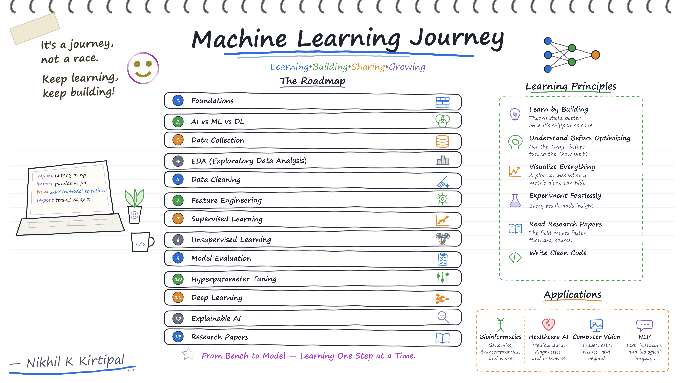

  

  <em>Foundations, classical algorithms, and hands-on practice.</em>

  <a href="../">← Back to BenchToModel</a>

## 👋 About This Section

This folder covers my work through core machine learning — the concepts, algorithms, and workflows that everything else builds on.

The focus is on understanding *why* methods work before reaching for them, and on writing code that's reproducible rather than just functional.

## 📚 Topics Covered

- **Foundations** — what ML is, and how it differs from AI and deep learning
- **Data Collection & EDA** — gathering data and exploring it before modeling
- **Data Cleaning** — handling missing values, outliers, and inconsistencies
- **Feature Engineering** — turning raw data into useful signal
- **Supervised Learning** — regression, classification, and their trade-offs
- **Unsupervised Learning** — clustering and dimensionality reduction
- **Model Evaluation** — metrics, cross-validation, and avoiding overfitting
- **Hyperparameter Tuning** — grid search, random search, and beyond

## 🛠️ Tools & Libraries

`Python` · `NumPy` · `pandas` · `scikit-learn` · `Matplotlib` · `Seaborn` · `Jupyter`

## 📝 Notes

Notebooks and notes are added as I work through each topic. This section is actively growing — some topics are more developed than others.

## 🔗 Related Sections

- 📁 [Deep_Learning](../Deep_Learning/) — neural networks and modern architectures
- 📁 [Computational_Biology](../Computational_Biology/) — applying these methods to biological data
